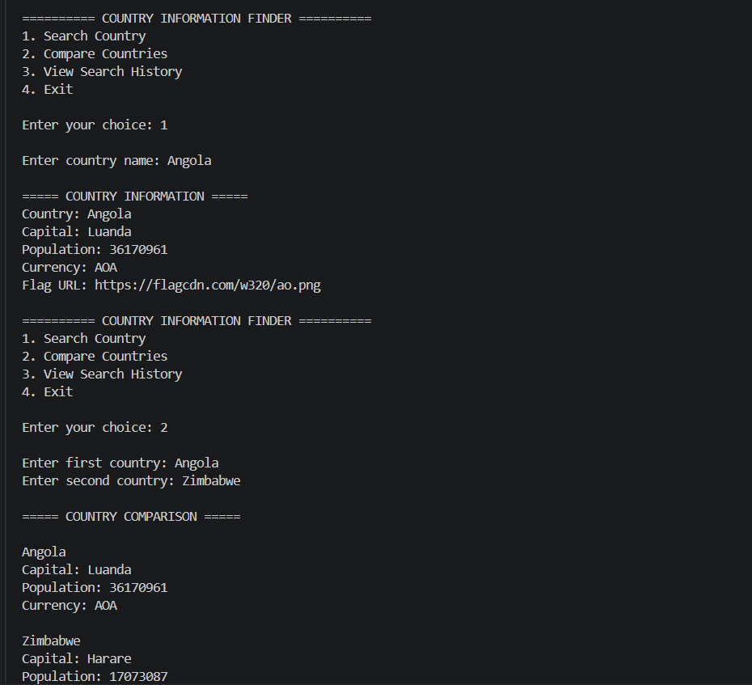

# Country Information Finder

A Python project that uses the REST Countries API to fetch and display country information.

## Features

- Search country by name
- Display capital city
- Display population
- Display currency
- Display country flag
- Compare two countries

## Technologies Used

- Python
- Requests
- REST API
- JSON

## Screenshots

### Country Information Output



### Country Flag Display


## How to Run

1. Install Python
2. Install the Requests library

```bash
pip install requests
```

3. Run the program

```bash
python main.py
```

## Author

Apoorba Sawaiyan
